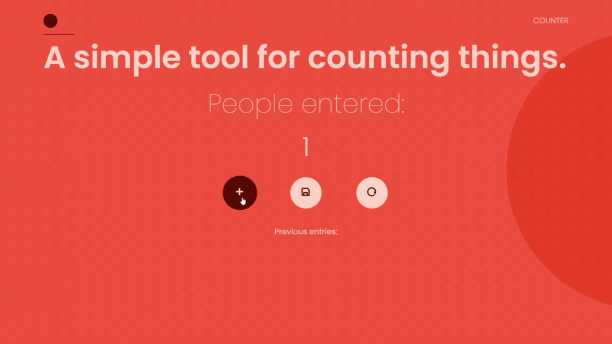

# Counter App
Simple JS application that allows you to count and keep track of anything you want.

## Table of contents
- [Overview](#overview)
  - [Description](#description)
  - [Features](#features)
  - [Demo](#demo)
  - [Links](#links)
- [Built with](#built-with)
- [Installation](#installation)
- [Usage](#usage)
- [Author](#author)
## Overview
### Description
Counter App is a simple and easy to use application that allows you to count and keep track of anything you want. It was built using Vanilla Javascript, making it lightweight and fast. With this app, you can easily add  to your count, save the current count, and clear all the entries.
The buttons are represented by icons, a plus icon for adding to the count, a floppy disk icon for saving the count, and a reset icon for clearing all entries.

## Features 
- Add to your count with the click of a button.
- Save the current count for later reference.
- Clear all saved entries with a click of a button.
### Demo

### Links

- Solution URL: [Github](https://github.com/fatima-xs/counter-app)
- Live Site URL: [Netlify](https://counter-app-fatima.netlify.app/)

## Built with
 
 
 

## Installation
- Download the application from the repository.
- Open the index.html file in a browser.
- Start counting.
    
## Usage
- Click on the "+" button to add to the count.
- Click on the floppy disk icon button to save the current count.
- Click on the reset icon button to clear all saved entries.

## Author
**Fatimata Ndiaye**

